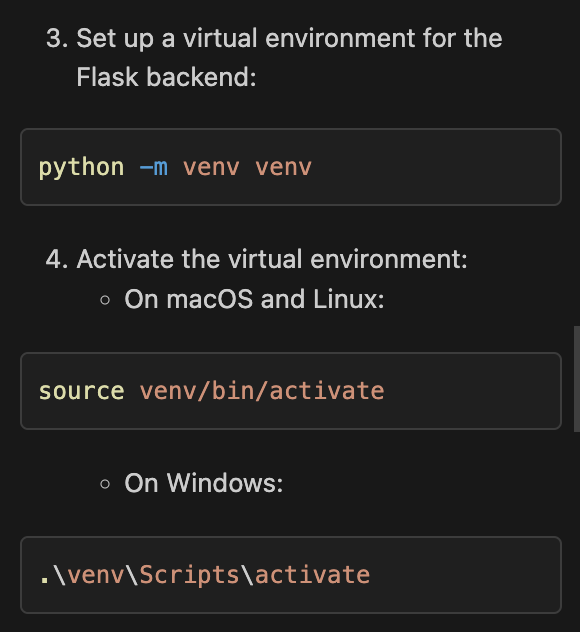

# EE461L_Brown_Rice
Repository for EE461L Semester Project

Utilize npm start within the client directory to bring up dummy login flow

Backend within server nonfunctional
Setup virtual environment for using flask
